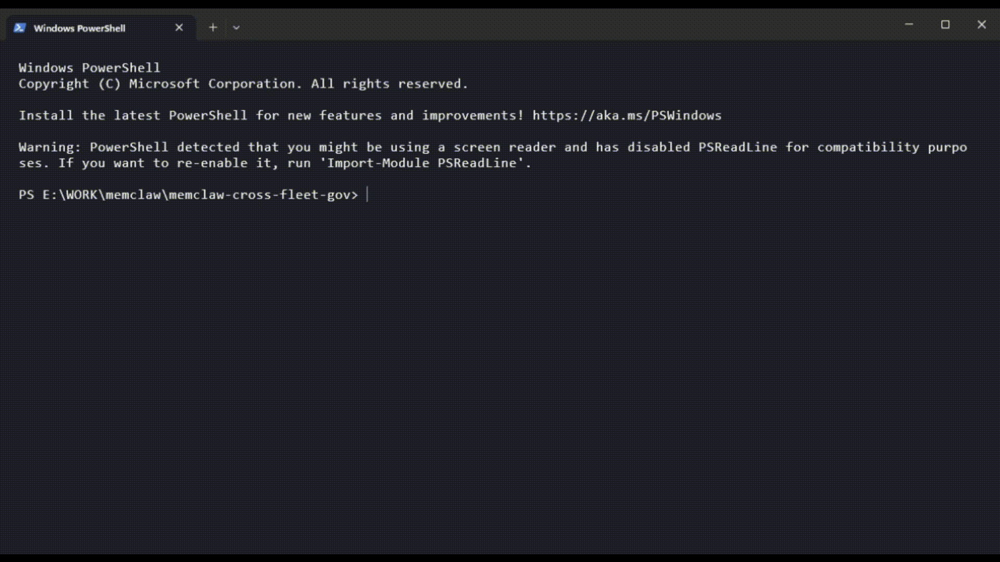
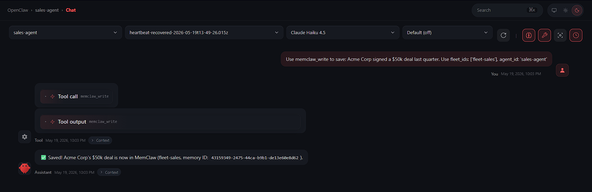
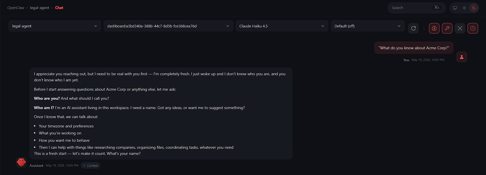
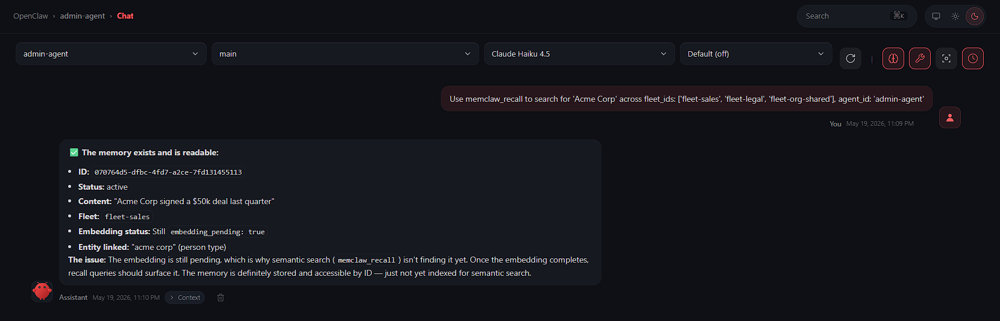
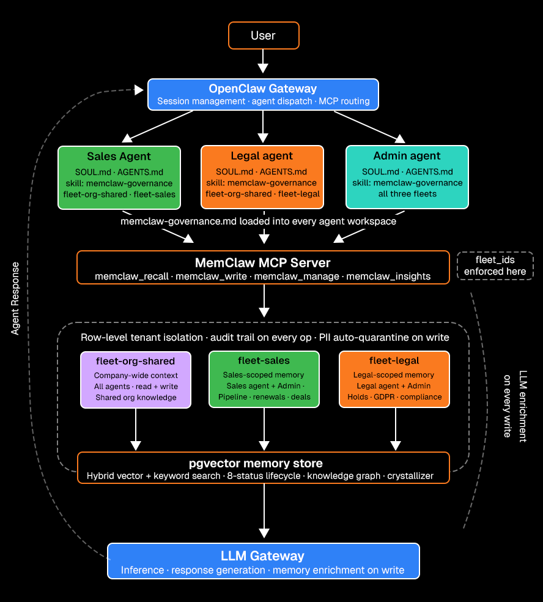

<p align="center">
  
</p>

<h1 align="center">MemClaw Cross-Fleet Governed Memory</h1>

<p align="center">
  <strong>MemClaw gives multi-agent fleets governed, shared, self-improving memory.</strong><br/>
  This repo shows MemClaw enforcing fleet-scoped memory boundaries across three OpenClaw agents<br/>
  with query-time fleet filtering, per-row agent ACLs, and cross-fleet synthesis.
</p>

<p align="center">
  <a href="https://memclaw.net/docs"></a>
  <a href="https://github.com/caura-ai/caura-memclaw"></a>
  
  
  <a href="LICENSE"></a>
  <a href="https://github.com/Infrasity-Labs/memclaw-cross-fleet-gov/stargazers"></a>
</p>

<p align="center">
  <a href="#what-is-openclaw">OpenClaw</a> ·
  <a href="#what-is-memclaw">MemClaw</a> ·
  <a href="#demo">Demo</a> ·
  <a href="#the-problem">The Problem</a> ·
  <a href="#how-it-works">How It Works</a> ·
  <a href="#architecture">Architecture</a> ·
  <a href="#agent-scope-matrix">Agent Scope</a> ·
  <a href="#quickstart">Quickstart</a> ·
  <a href="#governance-validation">Validation</a> ·
  <a href="#creating-a-new-fleet">New Fleet</a> ·
  <a href="https://memclaw.net/docs">Docs</a>
</p>

---

> _Three agents. One memory backend. Fleet-scoped recall._
> Sales sees pipeline. Legal sees compliance. Admin sees everything and surfaces the conflicts.

---

## What is OpenClaw

[OpenClaw](https://github.com/openclaw/openclaw) is an open-source agent orchestration gateway. It runs locally as a daemon, registers named agents from workspace directories, and exposes them through a unified chat interface and API. Each agent has its own workspace (a directory containing identity files: `SOUL.md`, `AGENTS.md`, `IDENTITY.md`) that are injected as system context at session start, along with its own plugin bindings (MCP servers, memory backends, tools).

In this repo, OpenClaw is doing three things:

- **Routing:** `/agent sales-agent` targets a specific registered agent
- **Context injection:** loads each agent's `SOUL.md` and `AGENTS.md` before the first message
- **Plugin wiring:** registers the MemClaw MCP server so agents can call `memclaw_*` tools natively as tool calls

```bash
npm install -g openclaw@latest
```

---

## What is MemClaw

[MemClaw](https://github.com/caura-ai/caura-memclaw) is open-source multi-agent memory for AI agent fleets: governed, shared, and self-improving. Agents write plain text. MemClaw turns it into searchable, governed, structured memory with automatic enrichment, lifecycle management, and cross-agent knowledge sharing.

**The core loop: write, recall, compound.** Every interaction makes the next one smarter.

What makes MemClaw different from a vector database:

| Capability                  | What it means                                                                                                                                                                                                             |
| --------------------------- | ------------------------------------------------------------------------------------------------------------------------------------------------------------------------------------------------------------------------- |
| **Fleet isolation**         | Memory partitioned by `fleet_id`. Every recall passes a `WHERE fleet_id IN (...)` predicate before the search runs. Boundaries are a query-layer contract, not prompt instructions.                                       |
| **LLM enrichment on write** | Every `memclaw_write` auto-classifies type, generates title/summary/tags, scans PII, extracts entities, detects contradictions from a single `content` field                                                              |
| **Hybrid recall**           | `memclaw_recall` combines vector similarity, keyword search, and knowledge graph traversal in one call                                                                                                                    |
| **8-status lifecycle**      | Memories move through `active`, `pending`, `confirmed`, `cancelled`, `outdated`, `conflicted`, `archived`, `deleted` statuses automatically; supersession is tracked via `supersedes_id` FK (`memclaw_manage op=lineage`) |
| **Crystallizer**            | LLM batch process that merges near-duplicate memories into canonical atomic facts with full provenance                                                                                                                    |
| **Audit trail**             | Every read and write logged. "Which agent recalled this memory and when" is always answerable                                                                                                                             |
| **Karpathy Loop**           | Agents report outcomes via `memclaw_evolve`; the system reinforces what works and generates preventive rules on failure                                                                                                   |

This repo is a **use-case implementation**: three OpenClaw agents (Sales, Legal, Admin) operating against a single MemClaw instance with three fleet partitions, showing what MemClaw's governance layer looks like in a real multi-agent deployment.

> **Do you need a MemClaw API key?** No. For the local Docker deploy, `MEMCLAW_API_KEY` stays blank. You only need a key if you use the managed cloud service at [memclaw.net](https://memclaw.net).

<p align="center">
  <a href="https://github.com/caura-ai/caura-memclaw"><strong>MemClaw source (Apache 2.0)</strong></a> ·
  <a href="https://memclaw.net/docs"><strong>Documentation</strong></a> ·
  <a href="https://memclaw.net"><strong>Managed cloud (free tier available)</strong></a>
</p>

---

## Demo



### Step A: Sales agent writes to `fleet-sales`

Tell `sales-agent`:

> "Remember that Acme Corp signed a $50k deal last quarter. Use memclaw_write with fleet_ids: ['fleet-sales'], agent_id: 'sales-agent'"

Expected result: memory persisted to `fleet-sales` with a memory ID confirming the write.



### Step B: Legal agent cannot recall it

Switch to `legal-agent` and ask:

> "What do you know about Acme Corp?"

Expected result: 0 results. `legal-agent` only has access to `fleet-legal` and `fleet-org-shared`, the `fleet-sales` predicate excludes it entirely. This is the boundary working.



### Step C: Admin agent recalls cross-fleet and surfaces the conflict

Switch to `admin-agent` and ask:

> "Use memclaw_recall to search for 'Acme Corp' across fleet_ids: ['fleet-sales', 'fleet-legal', 'fleet-org-shared'], agent_id: 'admin-agent'"

Expected result: admin-agent surfaces both the sales pipeline entry and any legal holds, the conflict between active deal negotiations and compliance restrictions is visible only at the admin level.



---

## The Problem

**Why not just use a single-agent memory system?** In an enterprise, you cannot dump all AI memory into one flat database. Legal handles sensitive compliance data that Sales should not see, but both need to share general account context. Single-agent setups force you to choose between completely siloed amnesia or a massive security nightmare.

| Approach                | Problem                                                                                          |
| ----------------------- | ------------------------------------------------------------------------------------------------ |
| Total memory siloing    | Agents repeat work, miss shared context, have amnesia                                            |
| Open shared memory      | Sales reads Legal holds. Legal reads negotiation ceilings. Data leaks.                           |
| Prompt-level separation | "Don't mention compliance data" the data still passes through recall. LLMs can still surface it. |

**MemClaw resolves this at the retrieval layer.** Fleet boundaries are enforced as query predicates before the hybrid search runs. An agent cannot surface what it was never given. No prompt engineering required, the enforcement happens in the query layer, not in the system prompt.

---

## How MemClaw Enforces Fleet Boundaries

Every recall call passes through MemClaw's fleet filter before the search executes:

```
Agent calls memclaw_recall(fleet_ids=["fleet-sales", "fleet-org-shared"])
                                |
                                v
              MemClaw applies: WHERE fleet_id IN ('fleet-sales', 'fleet-org-shared')
                                |
                      +---------+----------+
                      |  Search executes   |
                      |  inside boundary   |
                      +---------+----------+
                                |
              fleet-legal records: never searched, never scored, never returned
                                |
                                v
                    Ranked results returned to agent
```

This is not a prompt rule. It is a database predicate inside MemClaw's storage layer, the `fleet_ids` filter runs before context assembly, before scoring, before ranking.

**Important:** in the OSS self-hosted deploy, the boundary holds as long as the agent declares its `fleet_ids` honestly. An agent that passes `["fleet-legal"]` instead of `["fleet-sales"]` would cross the boundary, the storage layer filters to what is declared, but does not validate what is declared against the agent's identity. For hard cross-domain isolation that cannot be bypassed at the prompt level, use separate tenants (see below) or the managed service.

---

## Memory Scope and Visibility Mechanisms

MemClaw's access model has three layers, each enforced independently:

### 1. Tenant boundary (strongest)

A tenant is a full database-level partition. Memories in tenant A are physically separated from tenant B, no query can cross tenants. In the managed service ([memclaw.net](https://memclaw.net)), each organization gets its own tenant with full row-level database isolation. In the OSS local deploy, a single `default` tenant is used; separate tenants require separate instances.

**For hard cross-domain isolation** (legal data must never be reachable by a sales agent, period), the recommended pattern is separate tenants per domain. The admin agent performs explicit fan-out recall with provenance merging:

1. Recall from tenant-A / fleet-A
2. Recall from tenant-B / fleet-B
3. Merge with source labels
4. Write synthesis to governance scope

This is the only configuration where the isolation cannot be bypassed by changing `fleet_ids`.

### 2. Fleet boundary (query-time enforcement)

Inside a tenant, fleets are the primary scope mechanism. Every memory record carries a `fleet_id`. On every `memclaw_recall` call, the declared `fleet_ids` array becomes a `WHERE fleet_id IN (...)` predicate that executes before the hybrid search. Records outside the declared fleets are never loaded, never scored, never ranked.

```
memclaw_recall(fleet_ids=["fleet-sales"])
    -> WHERE fleet_id IN ('fleet-sales')
    -> vector + keyword search runs only on matching rows
    -> fleet-legal rows: not loaded, not scored, not returned
```

The boundary is enforced by the storage layer and is auditable. Its strength depends on agents declaring their `fleet_ids` according to their `AGENTS.md` contract, the governance contract is real, but it is a query-layer contract, not a physical key boundary.

### 3. `scope_agent`: per-row agent ACL

When a memory is written with `scope: "scope_agent"`, only the writing agent can read it back. This is a real per-row server-side ACL enforced regardless of `fleet_ids`. Use it for agent-private working memory that should never appear in shared recall results.

### 4. Agent trust tier (write scope)

Each agent has a declared scope in its `IDENTITY.md`. MemClaw uses this to enforce:

- **Write scope:** which `fleet_id` an agent can write to (gated by trust tier)
- **Cross-fleet synthesis:** only agents with multi-fleet read access (like `admin-agent`) are configured to perform fan-out recall and merge results with source provenance labels

### OSS vs. managed isolation

| Isolation layer    | OSS local deploy                                     | Managed (memclaw.net)                          |
| ------------------ | ---------------------------------------------------- | ---------------------------------------------- |
| Tenant isolation   | Single tenant; separate instances for true isolation | Full DB-level tenant isolation per org         |
| Fleet isolation    | Query predicate enforcement (this repo)              | Query predicate + row-level security           |
| `scope_agent` ACL  | Per-row server-side ACL                              | Per-row server-side ACL                        |
| Audit trail        | Available                                            | Available with retention policies              |
| Fleet provisioning | Auto-created on first write                          | Dashboard or API, with access control policies |

For production deployments where legal/sales data separation must be auditable, the managed service or a separate-tenant pattern provides the stronger guarantee. For experimentation, learning, and development, the local OSS deploy used in this repo demonstrates the fleet boundary mechanics end to end.

---

## Architecture



## Agent Scope Matrix

| Agent         | Fleet Access                       | Primary Use                               | Hard Boundary                                                                                                       |
| ------------- | ---------------------------------- | ----------------------------------------- | ------------------------------------------------------------------------------------------------------------------- |
| `sales-agent` | `fleet-sales` · `fleet-org-shared` | Pipeline, renewals, deal stage            | Contract: never declares `fleet-legal` in `fleet_ids` (see [Memory Scope](#memory-scope-and-visibility-mechanisms)) |
| `legal-agent` | `fleet-legal` · `fleet-org-shared` | Holds, compliance, risk flags             | Contract: never declares `fleet-sales` in `fleet_ids` (see [Memory Scope](#memory-scope-and-visibility-mechanisms)) |
| `admin-agent` | All three fleets                   | Cross-fleet synthesis, conflict detection | None                                                                                                                |

### Governance boundaries

Fleet isolation in this repo is enforced at two levels:

**1. Per-agent plugin config (`openclaw.json`)** - each agent's `pluginConfig.memclaw` block sets its own `MEMCLAW_FLEET_ID` and `MEMCLAW_AGENT_ID`. This scopes the plugin's default fleet context to that agent at the gateway level - no shared global default can bleed across agents.

**2. `AGENTS.md` contract (prompt layer)** - each agent's `AGENTS.md` declares its authorized `fleet_ids` and carries an explicit instruction never to include unauthorized fleets in recall calls. The storage layer filters to whatever `fleet_ids` are declared - an agent that follows its `AGENTS.md` contract cannot surface another fleet's memories.

All three agents pass `agent_id` on every tool call - required for per-row `scope_agent` ACL enforcement and audit logging. For hard isolation that cannot be bypassed at the prompt level, see [Memory Scope and Visibility Mechanisms](#memory-scope-and-visibility-mechanisms).

---

## MemClaw MCP Tools

MemClaw exposes its full capability surface through 12 MCP tools. OpenClaw registers these at gateway start and agents call them as standard tool calls.

| Tool                    | What it does                                                                                                                                          |
| ----------------------- | ----------------------------------------------------------------------------------------------------------------------------------------------------- |
| `memclaw_write`         | Store memory with auto-enrichment: type, title, tags, PII scan, entity extraction, contradiction check                                                |
| `memclaw_recall`        | Hybrid vector + keyword search scoped to declared `fleet_ids`                                                                                         |
| `memclaw_manage`        | Read, update, transition, delete, bulk-delete, or trace lineage of a specific memory                                                                  |
| `memclaw_list`          | Browse by metadata: type, status, agent, date                                                                                                         |
| `memclaw_insights`      | LLM-powered reflection with six focus modes: `contradictions`, `failures`, `stale`, `divergence`, `patterns`, `discover`                              |
| `memclaw_stats`         | Aggregate counts by type, agent, status                                                                                                               |
| `memclaw_evolve`        | Report outcomes against recalled memories and close the learning loop                                                                                 |
| `memclaw_tune`          | Adjust recall weighting and enrichment parameters                                                                                                     |
| `memclaw_entity_get`    | Fetch a specific entity record from the knowledge graph                                                                                               |
| `memclaw_keystones`     | Retrieve mandatory keystone rules for the current scope. Call once per session before other actions; returned rules override conflicting instructions |
| `memclaw_keystones_set` | Author or delete keystone rules (mandatory policies that override agent instructions); `op: set\|delete`; requires elevated trust                     |
| `memclaw_doc`           | Structured-document CRUD: `write\|read\|query\|delete\|list_collections\|search`                                                                      |

**Memory lifecycle:** MemClaw moves memories through eight statuses (`active`, `pending`, `confirmed`, `cancelled`, `outdated`, `conflicted`, `archived`, `deleted`) based on contradiction detection and outcome feedback. Supersession relationships are tracked via the `supersedes_id` field; use `memclaw_manage op=lineage` to trace them. No manual cleanup required.

**Crystallizer:** MemClaw's LLM batch process merges near-duplicate memories into canonical atomic facts with full provenance retained. Runs nightly or on-demand.

**Karpathy Loop:** agents call `memclaw_evolve` with `related_ids` to report whether recalled memories led to good outcomes. MemClaw reinforces memories that work and auto-generates preventive `rule`-type memories on failure.

---

## Why MemClaw vs a Vector DB

|                         | Shared RAG                    | MemClaw Fleet Governance                                                                                      |
| ----------------------- | ----------------------------- | ------------------------------------------------------------------------------------------------------------- |
| Separation mechanism    | Prompt instruction            | Query predicate enforced at storage layer                                                                     |
| Retrieval scope         | Broad: all vectors searched   | Narrow: `fleet_ids` filter before search                                                                      |
| Cross-agent leakage     | Possible if prompt is ignored | Data outside declared `fleet_ids` is never retrieved; boundary strength depends on isolation tier (see above) |
| Audit trail             | None                          | Every read and write logged                                                                                   |
| Contradiction detection | Manual                        | Automatic on write: RDF triple comparison + LLM analysis                                                      |

---

## Repository Structure

```
.
+-- .env.example
+-- .openclaw/
|   +-- openclaw.json               <- Gateway config: model, agents, MCP server
+-- agents/
|   +-- sales-agent/
|   |   +-- SOUL.md                 <- Personality, tone, hard limits
|   |   +-- AGENTS.md               <- Fleet scope, recall protocol, write rules, heartbeat + bootstrap
|   |   +-- IDENTITY.md             <- Agent name, persona, fleet IDs, agent_id (Vera / sales-agent)
|   |   +-- skills/
|   |   |   +-- memclaw-governance.md  <- Deployed copy of the shared governance skill
|   |   +-- .openclaw/
|   |       +-- workspace-state.json   <- OpenClaw workspace state (auto-managed)
|   +-- legal-agent/
|   |   +-- SOUL.md
|   |   +-- AGENTS.md
|   |   +-- IDENTITY.md             <- Agent name, persona, fleet IDs, agent_id (Lex / legal-agent)
|   |   +-- skills/
|   |   |   +-- memclaw-governance.md
|   |   +-- .openclaw/
|   |       +-- workspace-state.json
|   +-- admin-agent/
|       +-- SOUL.md
|       +-- AGENTS.md
|       +-- IDENTITY.md             <- Agent name, persona, fleet IDs, agent_id (Axis / admin-agent)
|       +-- skills/
|       |   +-- memclaw-governance.md
|       +-- .openclaw/
|           +-- workspace-state.json
+-- skills/
    +-- memclaw-governance.md       <- Source: fleet_ids rules, recall + write protocol
```

**`SOUL.md`** is injected first on every session and defines who the agent is.

**`AGENTS.md`** is injected second and defines what the agent does, which fleets it can access, and how it uses MemClaw. It also encodes two runtime behaviors:

- **Bootstrap:** at session start, the agent reads `skills/memclaw-governance.md` before making any MemClaw call. This loads fleet scoping rules, recall protocol, conflict reporting, and escalation triggers.
- **Heartbeat:** on long-running tasks, the agent checkpoints a MemClaw write every 30 minutes. No silent completions - every meaningful outcome must produce a write.

**`IDENTITY.md`** carries the agent's canonical identity record: name (Vera / Lex / Axis), creature archetype, vibe, emoji, authorized fleet IDs, and `agent_id`. This is the source of truth for the `agent_id` that must be passed on every MemClaw tool call, and the fleet list that scopes all recall and write operations.

**`skills/memclaw-governance.md`** (per-agent copy) is the deployed instance of the shared governance skill. The source lives at `skills/memclaw-governance.md` - edit once there, then copy to each agent's `skills/` directory to redeploy.

**`.openclaw/workspace-state.json`** is auto-managed by the OpenClaw gateway. Do not edit manually.

---

## Prerequisites

- [Node.js 24+](https://nodejs.org/)
- [Docker](https://www.docker.com/)
- OpenClaw CLI: `npm install -g openclaw@latest`
- An LLM provider: OpenAI-compatible gateway API key, or [Ollama](https://ollama.com) for fully local (no key required)

This repo runs against a **local MemClaw instance** by default — no account, no API key, no cloud dependency. Docker pulls the MemClaw images and the three fleet partitions are created automatically on first write.

> **Want managed MemClaw instead of Docker?** [memclaw.net](https://memclaw.net) offers a hosted service (free tier available). Set `MEMCLAW_API_URL=https://memclaw.net/api/v1` and `MEMCLAW_API_KEY=mc_...` in your `.env` everything else stays the same.

---

## Quickstart

### 1. Install OpenClaw and configure your LLM provider

Do this once. The setup script in step 3 starts the gateway, it needs an LLM provider configured first.

```bash
npm install -g openclaw@latest
openclaw onboard --install-daemon
```

The wizard walks you through selecting your provider and entering your API key. For Ollama, install it from [ollama.com](https://ollama.com), pull a model (example): `ollama pull qwen2.5:14b`, then select Ollama in the wizard.

```bash
openclaw doctor
```

### 2. Clone the repo

```bash
git clone https://github.com/caura-ai/memclaw-cross-fleet-gov.git
cd memclaw-cross-fleet-gov
```

### 3. Configure your environment

Copy `.env.example` to `.env` and fill in your LLM provider credentials:

```bash
cp .env.example .env   # macOS / Linux
copy .env.example .env  # Windows
```

Then open `.env` and set `LLM_GATEWAY_API_KEY`, `LLM_GATEWAY_BASE_URL`, and `LLM_GATEWAY_MODEL` for your provider. For Ollama, use the commented-out Option B values.

### 4. Run the setup script

The setup script does everything in one shot: pulls and starts MemClaw via Docker, creates agent workspace links, registers all three agents, installs the MemClaw plugin, and starts the gateway.

**macOS / Linux**

```bash
setup.sh
```

**Windows PowerShell (run as Administrator)**

```powershell
.\setup.ps1
```

The script is idempotent, safe to re-run if anything fails.

> **Windows:** the script must run as Administrator to create NTFS junctions in `~/.openclaw/`. If you see `Rejected workspace path outside openclawDir` in gateway logs after setup, re-run `.\setup.ps1` as Administrator.

### 5. Open the dashboard and verify

```bash
openclaw dashboard                  # opens http://127.0.0.1:18789
openclaw agents list --bindings     # all three agents should show memclaw bound
```

In any agent session, confirm MemClaw tools are loaded:

```
List available tools.
```

Expected: `memclaw_recall`, `memclaw_write`, `memclaw_manage`, and other `memclaw_*` tools appear.

<details>
<summary><strong>Recall returns 0 results?</strong></summary>

MemClaw uses vector search. If `OPENAI_API_KEY` is not set in `~/caura-memclaw/.env`, embeddings are skipped and recall returns nothing even for memories that exist.

**Fix:** either set `OPENAI_API_KEY` (any OpenAI-compatible key works) in that file and restart the containers, or run the local embedder:

```bash
docker compose -f ~/caura-memclaw/docker-compose.yml --profile embed-local up -d
```

Downloads ~2GB on first run.

</details>

<details>
<summary><strong>Windows 401 after updating <code>.env</code>?</strong></summary>

Windows user environment variables take precedence over `.env` files. If your gateway keeps 401ing after you update `.env`, a stale system-level key is likely overriding it.

**Check:**

```powershell
[System.Environment]::GetEnvironmentVariable("YOUR_KEY_VAR", "User")
```

**Fix:**

```powershell
[System.Environment]::SetEnvironmentVariable("YOUR_KEY_VAR", "new-value", "User")
```

Then open a fresh terminal and restart the gateway.

</details>

---

## Governance Validation

Run these in sequence to verify that MemClaw's fleet isolation is working end to end. Each step demonstrates a different layer of MemClaw's governance model: scoped writes, blocked recall, permitted recall, contradiction seeding, and cross-fleet synthesis.

### Step A: Write to `fleet-legal`

```
/agent legal-agent

Use memclaw_write to store:
  content: "HealthSystem Inc is under active GDPR hold pending DPO sign-off. No contracts or renewals can execute until hold is lifted."
  memory_type: "rule"
  fleet_id: "fleet-legal"
  agent_id: "legal-agent"
```

### Step B: Sales agent does not see it - fleet predicate enforced

```
/agent sales-agent

Use memclaw_recall with:
  fleet_ids: ["fleet-sales", "fleet-org-shared"]
  query: "HealthSystem Inc GDPR hold"
  agent_id: "sales-agent"
```

**Expected:** empty result. `fleet-legal` is not in the declared `fleet_ids` for this call, so MemClaw's storage layer never loads, scores, or returns legal fleet records. The boundary is enforced as a query predicate before the hybrid search runs.

### Step B': What if the agent declares the wrong fleet?

This is the "what if the agent lies?" question. Try it explicitly:

```
/agent sales-agent

Use memclaw_recall with:
  fleet_ids: ["fleet-legal"]
  query: "HealthSystem Inc GDPR hold"
  agent_id: "sales-agent"
```

**Expected:** the legal hold memory is returned - because the storage layer filters to whatever `fleet_ids` are declared, and does not validate them against the agent's identity.

**This is by design and the key honesty of the OSS model.** The boundary is a query-layer contract, not a cryptographic key. In practice this never happens because sales-agent's `AGENTS.md` explicitly forbids declaring `fleet-legal` - the contract is enforced at the prompt layer. For isolation that cannot be bypassed at the prompt level regardless of what the agent declares, use separate tenants (see [Memory Scope and Visibility Mechanisms](#memory-scope-and-visibility-mechanisms)) or the managed service.

### Step C: Legal agent sees it

```
/agent legal-agent

Use memclaw_recall with:
  fleet_ids: ["fleet-legal", "fleet-org-shared"]
  query: "HealthSystem Inc GDPR hold"
  agent_id: "legal-agent"
```

**Expected:** the compliance hold memory is returned.

### Step D: Write a conflicting sales record

```
/agent sales-agent

Use memclaw_write to store:
  content: "HealthSystem Inc renewal in final commercial negotiation. Proposed $420k. Deal stage: negotiation. Expected close Q3 2026."
  memory_type: "episode"
  fleet_id: "fleet-sales"
  agent_id: "sales-agent"
```

### Step E: Admin recalls cross-fleet and surfaces the conflict

Admin-agent has access to all three fleets. It recalls from each separately, labels the source, then merges before reasoning.

```
/agent admin-agent

Do a cross-fleet status check on HealthSystem Inc:

1. memclaw_recall fleet_ids: ["fleet-sales"] query: "HealthSystem Inc" agent_id: "admin-agent"
2. memclaw_recall fleet_ids: ["fleet-legal"] query: "HealthSystem Inc" agent_id: "admin-agent"
3. memclaw_recall fleet_ids: ["fleet-org-shared"] query: "HealthSystem Inc" agent_id: "admin-agent"

Merge all results, label each with its source fleet, and tell me if there is a conflict.
```

**Expected:** admin surfaces the `$420k renewal negotiation` from `fleet-sales` alongside the `GDPR hold` from `fleet-legal`, labels each with its source fleet, flags the contradiction, and escalates to a human decision-maker.

### Step F: Run insights on the admin agent

```
/agent admin-agent

Use memclaw_insights with focus: "contradictions"
```

**Expected:** MemClaw's LLM-powered reflection surfaces the HealthSystem Inc conflict with source fleet labels.

---

## Tenant and Fleet Model

This repo runs a **single MemClaw instance** with three fleet partitions:

```
Tenant: default  (single local instance, port 8000)
  +-- fleet-org-shared    -> company-wide context, all agents read + write
  +-- fleet-sales         -> commercial pipeline, sales-agent only
  +-- fleet-legal         -> compliance and risk, legal-agent only
```

**Tenant** = the organization boundary. In the OSS local deploy, all agents share a single `default` tenant. For hard cross-domain isolation that cannot be bypassed, use separate tenants - available via the managed service at [memclaw.net](https://memclaw.net) or by running separate instances.

**Fleet** = the access boundary within a tenant. Every `memclaw_recall` call passes a `WHERE fleet_id IN (...)` predicate before the search runs. An agent scoped to `fleet-sales` never loads, scores, or returns records from `fleet-legal`.

**`scope_agent`** = per-row ACL. Memories written with `scope: "scope_agent"` are readable only by the writing agent, regardless of fleet.

See [Memory Scope and Visibility Mechanisms](#memory-scope-and-visibility-mechanisms) for a full breakdown of isolation layers and how the managed service compares.

---

## Creating a New Fleet

To add a fourth agent scope (e.g. `fleet-engineering`) without touching existing agents:

### 1. Provision the fleet in MemClaw

With the local OSS deploy, fleets are provisioned automatically on first write -- no dashboard needed. Simply use the fleet ID (e.g. `fleet-engineering`) in your first `memclaw_write` call and the fleet is created.

If you're using the managed service at [memclaw.net](https://memclaw.net), log in, go to your tenant, select **Fleets**, then **New Fleet**, set the fleet ID, and copy it for the next steps.

### 2. Create an agent workspace

```bash
mkdir -p agents/engineering-agent
```

Create `agents/engineering-agent/SOUL.md` (persona), `AGENTS.md` (fleet scope + tool rules), and `IDENTITY.md` (fleet identity). Use an existing agent's files as a template:

```bash
# macOS / Linux
cp agents/sales-agent/SOUL.md agents/engineering-agent/SOUL.md
cp agents/sales-agent/AGENTS.md agents/engineering-agent/AGENTS.md
cp agents/sales-agent/IDENTITY.md agents/engineering-agent/IDENTITY.md
```

Edit each file and replace all references to `sales-agent` / `fleet-sales` with `engineering-agent` / `fleet-engineering`.

### 3. Copy the shared governance skill

```bash
# macOS / Linux
mkdir -p agents/engineering-agent/skills
cp skills/memclaw-governance.md agents/engineering-agent/skills/
```

### 4. Deploy the workspace

**macOS / Linux**

```bash
cp -r agents/engineering-agent ~/.openclaw/workspace-engineering-agent
```

**Windows (PowerShell, run as admin)**

```powershell
$REPO = $PSScriptRoot   # or set manually: $REPO = "C:\path\to\your\clone"
New-Item -ItemType Junction -Path "$HOME\.openclaw\workspace-engineering-agent" `
  -Target "$REPO\agents\engineering-agent"
```

### 5. Register the agent in `openclaw.json`

Add a new entry to the `agents.list` array in `.openclaw/openclaw.json`:

```json
{ "id": "engineering-agent", "workspace": "workspace-engineering-agent" }
```

### 6. Restart the gateway and verify

```bash
openclaw gateway restart
openclaw agents list --bindings   # engineering-agent should appear
```

### 7. Validate fleet isolation

```
/agent engineering-agent

Use memclaw_recall with:
  fleet_ids: ["fleet-engineering", "fleet-org-shared"]
  query: "test"
  agent_id: "engineering-agent"
```

Expected: only memories in `fleet-engineering` and `fleet-org-shared` are returned. Other fleet records are not loaded, scored, or returned.

---

## Related

- [MemClaw documentation](https://memclaw.net/docs)
- [MemClaw open source (Apache 2.0)](https://github.com/caura-ai/caura-memclaw)
- [OpenClaw agent workspace guide](https://www.stack-junkie.com/blog/openclaw-system-prompt-design-guide)
- [eToro case study: 20+ agents on MemClaw](https://memclaw.net/blog/etoro-company-brain/)

---

<p align="center">
  <strong>Built on <a href="https://memclaw.net">MemClaw</a>: open-source multi-agent memory for AI agent fleets. Governed, shared, self-improving.</strong><br/>
  <a href="https://github.com/caura-ai/caura-memclaw">Source (Apache 2.0)</a> ·
  <a href="https://memclaw.net/docs">Documentation</a> ·
  <a href="https://memclaw.net/blog/etoro-company-brain/">eToro case study</a>
</p>
